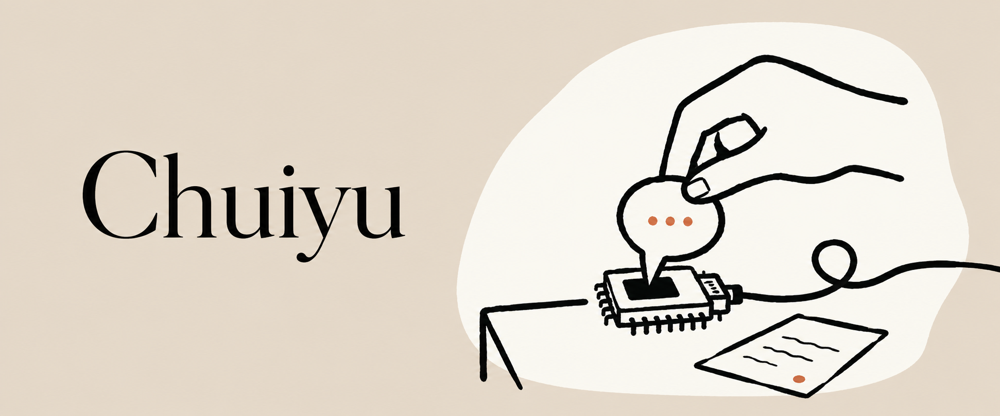

  

  <a href="#精选作品">精选作品</a> · <a href="https://chuiyu.wiki">个人手记</a> · <a href="https://github.com/ana52070?tab=repositories">所有项目 ↗</a>

 

## 精选作品

### 01 / 让语言连接硬件

通过 MCP，让大语言模型调用 STM32 上的函数，把对话变成硬件可以执行的动作。

[探索 MCP Control STM32 ↗](https://github.com/ana52070/MCP_Control_STM32)

 

### 02 / 让机器人走进现实

围绕 RTK、激光雷达与 ROS2，探索校园环境中的无地图自主导航。

[探索校园导航项目 ↗](https://github.com/ana52070/carplanning_code)

 

### 03 / 把探索留下来

把嵌入式、AI 与机器人开发中的实践整理成笔记，留给下一次探索。

[翻阅 Chuiyu Wiki ↗](https://chuiyu.wiki) · [查看源码](https://github.com/ana52070/chuiyu_Wiki)

 

---

### 桌边手记

作品之外，过程也值得记录。

[去我的知识库坐坐 ↗](https://chuiyu.wiki)

 

Chuiyu · <a href="https://github.com/ana52070">GitHub</a> / <a href="https://chuiyu.wiki">Wiki</a>
